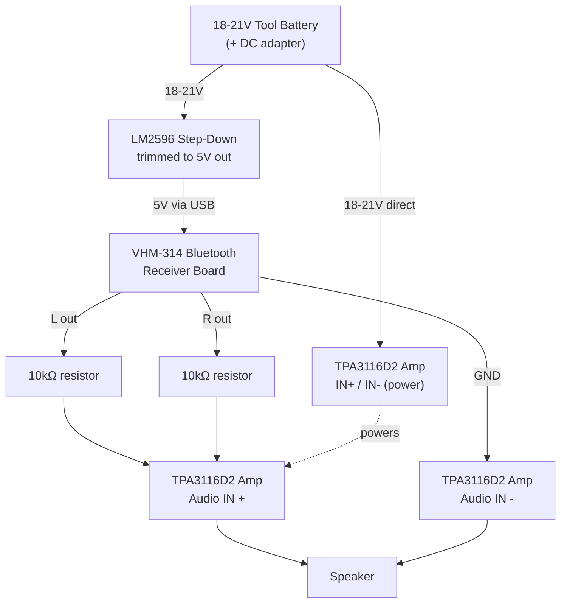

# DIY-wireless-hifi
Guide to building DIY Bluetooth speaker amplifiers that convert passive speakers into active wireless monitors with multi-speaker simultaneous playback using tool batters, amplifier boards, bluetooth boards, buck converters and a raspberry pi running ubuntu server..

# Hardware list
- RaspberryPi 4B + microsd
- 2x Amplifier boards (DollaTek DC 12V-24V TPA3116 D2 100W Mono Audio Channel Digital Audio Amplifier)
- 2x Bluetooth boards (Heemol VHM-314 Bluetooth Audio Board Receiver Bluetooth 5.0 mp3 Lossless Decoder Wireless Stereo Music Module)
- 2x DC-DC LM2596 Step Down Regulator Modules
- 2x Tool batteries (I used 4Ah 18-21V generic unbranded "makita" batteries and 2x DC adapters)
- 1x Mini-jack <> mini-jack cable cut in half (2 mini-jacks, basically)
- 2x 10kohm 0.25w resistors
- Wire

# Battery-Powered Bluetooth Mono Speaker — Wiring Schematic

Two identical, self-contained channels (one per tool battery). Each channel is a
mono TPA3116D2 amp fed by a stereo Bluetooth receiver, with the L and R outputs
summed through resistors into the single mono input.

> **Note:** A Raspberry Pi 4B + microSD is listed in the BOM but is not part of
> the audio signal path described below — update this doc once its role
> (e.g. network source, control/automation) is finalized.

## Signal path (per channel)

```
VHM-314 Bluetooth board (3.5mm stereo out, from a cut mini-jack cable)
        │
        ├── L  ──[10kΩ]──┐
        │                ├──► Amp "+" (IN) — TPA3116D2 mono input
        ├── R  ──[10kΩ]──┘
        │
        └── GND ─────────────► Amp "−" (IN) — direct, no resistor
```

The two 10 kΩ resistors mix the stereo L/R channels into one mono signal while
keeping the two Bluetooth outputs from being shorted together.

## Power path (per channel)

```
18–21V "Makita-style" tool battery
        │  (via DC adapter)
        ├────────────────────────────► TPA3116D2 amp  IN+ / IN−   (12–24V direct)
        │
        └──► LM2596 buck converter ──► trimmed to 5V ──► USB ──► VHM-314 BT board (VCC/GND)
```

The battery feeds the amplifier board directly (TPA3116D2 accepts 12–24V), and
separately feeds an LM2596 step-down module trimmed to 5V to power the
Bluetooth receiver over its USB input.

## Full per-channel schematic (Mermaid)



Duplicate this whole block a second time for the second battery/amp/Bluetooth
set — the two channels are electrically independent (no shared ground or
signal between them).

## Wiring table (per channel)

| From | To | Notes |
|---|---|---|
| Battery + / − | LM2596 IN+ / IN− | Raw 18–21V in |
| Battery + / − | Amp board VIN+ / VIN− ("IN"/"VCL" terminals) | Direct, no regulation needed (TPA3116D2 accepts 12–24V) |
| LM2596 OUT+ / OUT− | BT board 5V / GND (USB) | Trim LM2596 pot to 5.0V **before** connecting the BT board |
| BT board L out | 10kΩ resistor #1 | One leg to BT L pad, other leg to amp "+" input |
| BT board R out | 10kΩ resistor #2 | One leg to BT R pad, other leg to amp "+" input (shared node with R1) |
| BT board GND | Amp "−" input | Direct connection, no resistor |
| Amp speaker out + / − | Speaker | Standard 2-wire speaker connection 

  
